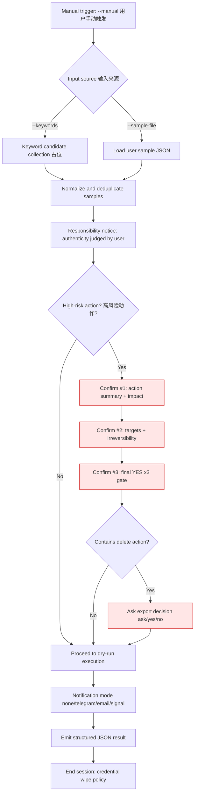

# vanish Flowchart (MVP / dry-run)

> English-first with Chinese notes for review clarity.

## Audit checkpoints / 审计检查点
- `--manual` is mandatory; reject scheduled/background invocations.
- High-risk actions require 3 confirmations; cannot be bypassed.
- Export decision must be collected before delete.
- Notification is user-selected; no-notify is valid.
- Credentials: env-only read, no disk persistence, minimum scope, shortest TTL, wipe after task.
